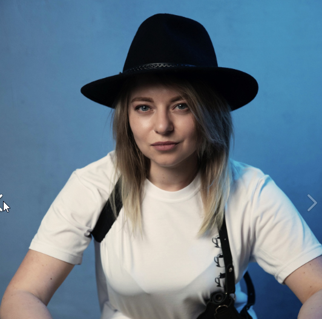

# Мой тестовый сайт для ДЗ 

## О себе

Меня зовут Марина. Мне 28 лет. У меня есть два котика)



У меня есть друзья(использую возможности маркдауна))): 
1. Юля
2. Света
3. Кристина

Ниже я просто добавлю пару абзацев оформления для освоения Markdown, потому что устала и в голову уже ничего не лезет. 

Lorem ipsum dolor sit amet, consectetur adipisicing elit. Assumenda quas fugit impedit delectus eos repellendus ratione pariatur sit magnam totam in at saepe nam numquam beatae maiores, natus, iusto nobis.

Lorem ipsum dolor sit amet, consectetur adipisicing elit. Assumenda quas fugit impedit delectus eos repellendus ratione pariatur sit magnam totam in at saepe nam numquam beatae maiores, natus, iusto nobis.

## Парочка списков

* Пункт 1

* Пункт 2

* Пункт 3


Пример кода на JavaScript из прошлого ДЗ:

```javascript

let messageObject = [];

for ( let t = 0; t < messages.length; t++) {
  messageObject[t] = {	author: messages[t][0],	text: messages[t][1]}
}
console.log(messageObject)

console.log('Вывод самих сообщений');

for (let i = 0; i < messageObject.length; i++) {
  console.log(messageObject[i]['author'] + ': ' + messageObject[i]['text']);
  }

```